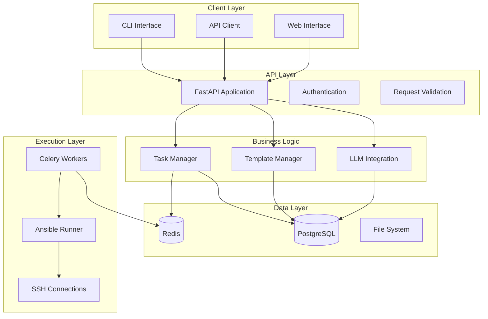
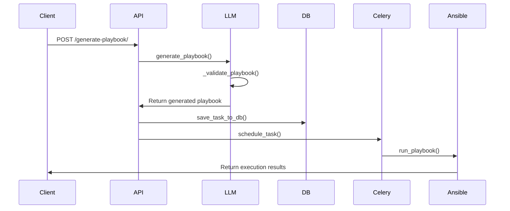
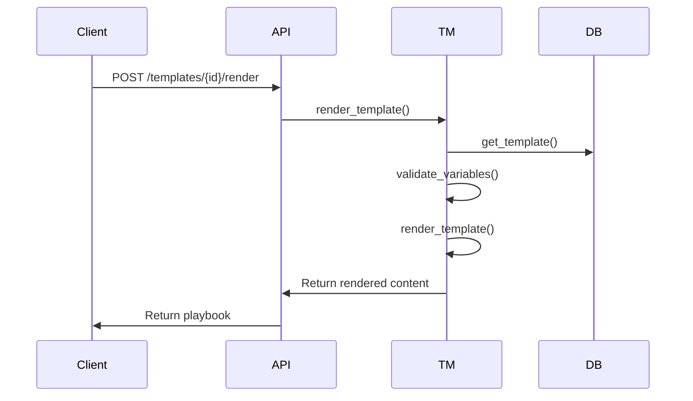

# Architecture Overview

## System Architecture

The LLM-Powered Ansible Controller follows a modern microservices architecture with clear separation of concerns and modular design.

## Core Components

### 1. API Layer (`src/crud/api.py`)

**Purpose**: Provides REST API endpoints for all system operations.

**Key Features**:
- FastAPI-based REST API
- Automatic OpenAPI documentation
- Request/response validation with Pydantic
- Dependency injection for database sessions
- Error handling and logging

**Main Endpoints**:
- `POST /generate-playbook/` - LLM-powered playbook generation
- `POST /add-task/` - Traditional task scheduling
- `GET /templates/` - Template management
- `GET /health` - System health check

### 2. LLM Integration (`src/llm/`)

**Purpose**: Handles AI-powered playbook generation and template management.

#### PlaybookGenerator (`src/llm/playbook_generator.py`)

**Core Functions**:
- `generate_playbook()` - Main generation function
- `_generate_with_openai()` - OpenAI API integration
- `_generate_with_anthropic()` - Anthropic API integration
- `_validate_playbook()` - Safety and syntax validation
- `_extract_yaml_from_response()` - YAML extraction from LLM responses

**Safety Features**:
- Dangerous pattern detection
- Configurable safety levels
- YAML validation
- Permission checks

#### TemplateManager (`src/llm/template_manager.py`)

**Core Functions**:
- `initialize_default_templates()` - Setup default templates
- `create_template()` - Create new templates
- `render_template()` - Render templates with variables
- `validate_variables()` - Variable validation against schemas

### 3. Data Models (`src/models/models.py`)

**Purpose**: Defines database schema and data structures.

**Key Models**:
- `TaskModel` - Ansible task storage
- `PlaybookTemplate` - Template storage and management

**Features**:
- SQLAlchemy ORM integration
- JSON field support for metadata
- Soft delete functionality
- Timestamp tracking

### 4. Task Management (`src/db/celery_app.py`)

**Purpose**: Handles asynchronous task execution and scheduling.

**Core Functions**:
- `schedule_task()` - Schedule playbook execution
- `run_playbook()` - Execute Ansible playbooks
- `save_task_to_db()` - Persist task data
- `restore_tasks_from_db()` - Restore tasks on startup

**Features**:
- Celery integration for async processing
- Ansible Runner for playbook execution
- Temporary file handling for generated playbooks
- Error handling and logging

### 5. Configuration (`src/config.py`)

**Purpose**: Centralized configuration management.

**Features**:
- Environment variable support
- Configuration validation
- LLM provider abstraction
- Safety level configuration

## Data Flow

### 1. Playbook Generation Flow

### 2. Template Rendering Flow

## Security Architecture

### 1. Input Validation
- Pydantic models for request validation
- YAML syntax validation
- Variable type checking
- Required field validation

### 2. Safety Checks
- Dangerous pattern detection
- Permission escalation validation
- Safety level enforcement
- Template variable validation

### 3. Access Control
- API key validation for LLM providers
- Database connection security
- SSH key management
- Environment variable protection

## Scalability Considerations

### 1. Horizontal Scaling
- Stateless API design
- Redis-based task queue
- Database connection pooling
- Container-based deployment

### 2. Performance Optimization
- Asynchronous task processing
- Template caching
- Database indexing
- Connection pooling

### 3. Monitoring and Observability
- Health check endpoints
- Structured logging
- Error tracking
- Performance metrics

## Technology Stack

### Backend
- **Python 3.9+** - Core programming language
- **FastAPI** - Web framework
- **SQLAlchemy** - ORM
- **Celery** - Task queue
- **Redis** - Message broker
- **PostgreSQL** - Primary database

### AI/ML
- **OpenAI GPT-4** - Primary LLM provider
- **Anthropic Claude** - Alternative LLM provider
- **Jinja2** - Template engine

### Infrastructure
- **Docker** - Containerization
- **Docker Compose** - Multi-container orchestration
- **Ansible Runner** - Playbook execution
- **SSH** - Remote execution

### Development
- **Pytest** - Testing framework
- **Black** - Code formatting
- **Flake8** - Linting
- **Click** - CLI framework

## Design Patterns

### 1. Dependency Injection
- Database session management
- Configuration injection
- Service layer abstraction

### 2. Repository Pattern
- Database access abstraction
- Template management
- Task persistence

### 3. Factory Pattern
- LLM provider selection
- Template rendering
- Task creation

### 4. Strategy Pattern
- Safety level implementation
- LLM provider switching
- Validation strategies

## Error Handling

### 1. API Errors
- HTTP status codes
- Structured error responses
- Validation error details
- Rate limiting

### 2. LLM Errors
- API connection failures
- Token limit exceeded
- Invalid responses
- Provider-specific errors

### 3. Execution Errors
- Ansible execution failures
- SSH connection issues
- File system errors
- Database errors

## Future Enhancements

### 1. Additional LLM Providers
- Local model support
- Custom model integration
- Multi-provider fallback

### 2. Advanced Features
- Playbook versioning
- Rollback capabilities
- Advanced scheduling
- Multi-environment support

### 3. Integration Capabilities
- CI/CD pipeline integration
- Monitoring system integration
- Notification systems
- Audit logging 