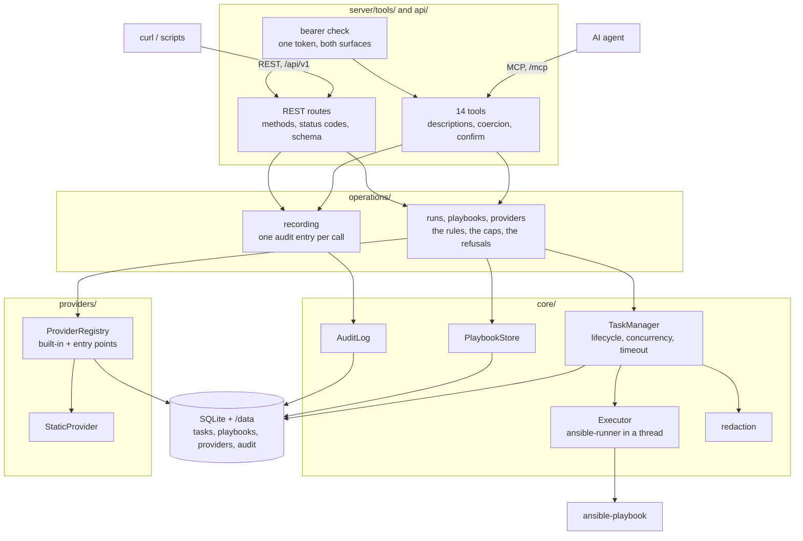
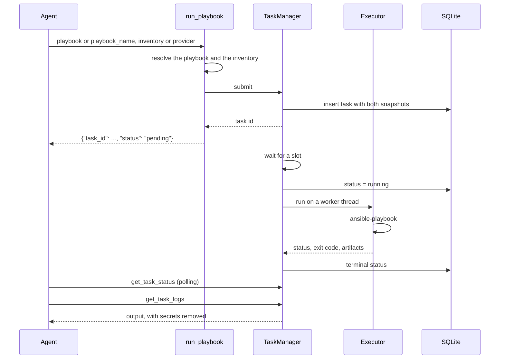

# Architecture

What the code does now. Why it is shaped this way is in the
[decision log](adr/INDEX.md); what it is for is in the [concept](concept.md).

*Русская версия: [docs/ru/architecture.md](ru/architecture.md)*

## The shape of it


```mermaid
graph TB
    Agent[AI agent] -->|MCP, /mcp| Tools
    Human[curl / scripts] -->|REST, /api/v1| Routes

    subgraph Surfaces["server/tools/ and api/"]
        Tools[14 tools<br/>descriptions, coercion, confirm]
        Routes[REST routes<br/>methods, status codes, schema]
        Auth[bearer check<br/>one token, both surfaces]
    end

    subgraph Ops["operations/"]
        Rules[runs, playbooks, providers<br/>the rules, the caps, the refusals]
        Rec[recording<br/>one audit entry per call]
    end

    subgraph Core["core/"]
        TM[TaskManager<br/>lifecycle, concurrency, timeout]
        Exec[Executor<br/>ansible-runner in a thread]
        Store[PlaybookStore]
        Redact[redaction]
        Audit[AuditLog]
    end

    subgraph Providers["providers/"]
        Registry[ProviderRegistry<br/>built-in + entry points]
        Static[StaticProvider]
    end

    Data[(SQLite + /data<br/>tasks, playbooks, providers, audit)]
    Ansible[ansible-playbook]

    Auth --> Tools
    Auth --> Routes
    Tools --> Rules
    Routes --> Rules
    Tools --> Rec
    Routes --> Rec
    Rules --> TM
    Rules --> Store
    Rules --> Registry
    Rec --> Audit
    TM --> Exec
    TM --> Redact
    Registry --> Static
    Exec --> Ansible
    TM --> Data
    Store --> Data
    Audit --> Data
    Registry --> Data
```

Four layers, one direction of dependency. The two surfaces know about
`operations/`; `operations/` knows about `core/` and `providers/`; they know
about `db/`; and nothing knows about a surface. That is what lets the same
refusal reach an agent as a sentence and a script as a 400 without either
surface holding a rule of its own (ADR-0015).

## What each part is responsible for

### `server/`

| Module | Responsibility |
|---|---|
| `app.py` | Builds the server, the services and the lifespan; refuses an unsafe exposure |
| `tools/tasks.py` | `run_playbook`, `get_task_status`, `get_task_logs`, `cancel_task`, `list_tasks` |
| `tools/playbooks.py` | `save_playbook`, `syntax_check_playbook`, `list_playbooks`, `get_playbook`, `delete_playbook` |
| `tools/providers.py` | `add_provider`, `list_providers`, `get_inventory`, `delete_provider` |
| `instrumentation.py` | One wrapper per tool: records the call, turns a failure into a sentence |
| `http.py` | Bearer check, `/healthz`, and the uvicorn entry that serves both surfaces |

A tool is a function with a docstring, because the docstring is what an agent
reads when choosing it. That makes tool descriptions part of the contract rather
than documentation, and the [eval harness](../evals/README.md) measures them.
What a tool does *not* hold is the rule it enforces: that lives one layer down,
where the REST routes read it too.

### `api/`

| Module | Responsibility |
|---|---|
| `app.py` | Builds the REST application and its schema at `/api/v1/openapi.json` |
| `routes/runs.py` | `POST /runs`, `GET /runs`, `GET /runs/{id}`, `GET /runs/{id}/logs`, `POST /runs/{id}/cancel` |
| `routes/playbooks.py` | `GET`/`PUT`/`DELETE /playbooks[/{name}]`, `POST /syntax-checks` |
| `routes/providers.py` | `GET`/`PUT`/`DELETE /providers[/{name}]`, `GET /providers/{name}/inventory` |
| `models.py` | What a request body may contain; unknown fields are refused |
| `errors.py` | Refusal to status code: 400 wrong, 404 absent, 500 our fault |

There is no `confirm` parameter here: on this surface the method is the
statement of intent (ADR-0015). The answers are the operations' own JSON, so
nothing can be added below and silently filtered out on the way through.

### `operations/`

| Module | Responsibility |
|---|---|
| `runs.py` | Start a run, read its status and logs, cancel it, list recent ones |
| `playbooks.py` | Store, list, read, syntax-check and delete playbooks |
| `providers.py` | Configure providers, resolve an inventory, remove a configuration |
| `errors.py` | How a call is refused: `require`, `found`, `confirmed` |
| `coercion.py` | Accepts the argument shapes callers actually send |
| `limits.py` | What one answer is capped at, wherever it is asked for |
| `recording.py` | One audit entry per call, under a name both surfaces share |

This is where "exactly one of playbook or playbook_name", "a malformed playbook
is refused before a task exists" and "at most 2000 log lines per call" live. A
rule held twice is a rule that eventually differs between the copies, so it is
held once.

### `core/`

`TaskManager` owns a run from submission to a terminal status: it persists the
task, queues it behind a semaphore, enforces a timeout that `ansible-runner` does
not provide, cancels on request, and fails anything left active by a crashed
process on the next start. Every path out of it writes a terminal status, because
a row stuck at `running` is the one failure a polling agent cannot recover from.

`Executor` is the only thing that talks to `ansible-runner`. The library is
blocking, so each run is pushed onto a worker thread and the event loop stays
free. One directory per run holds the playbook and inventory it used and the
artifacts it produced.

`PlaybookStore` keeps playbooks by name and refuses text that is not a playbook.
`redaction` removes secrets from anything leaving the process. `AuditLog` records
every call, its outcome and the run it produced.

### `providers/`

A provider answers one question: which hosts. `ProviderRegistry` holds the
built-in plugins and any published through the `ansible_mcp.providers` entry
point group; a third-party plugin that fails to import is logged and skipped.
`Providers` stores configuration, reports which providers currently work, and
resolves an inventory on demand.

## What a run looks like


```mermaid
sequenceDiagram
    participant Agent
    participant Tool as run_playbook
    participant TM as TaskManager
    participant Exec as Executor
    participant DB as SQLite

    Agent->>Tool: playbook or playbook_name, inventory or provider
    Tool->>Tool: resolve the playbook and the inventory
    Tool->>TM: submit
    TM->>DB: insert task with both snapshots
    TM-->>Tool: task id
    Tool-->>Agent: {"task_id": ..., "status": "pending"}

    TM->>TM: wait for a slot
    TM->>DB: status = running
    TM->>Exec: run on a worker thread
    Exec->>Exec: ansible-playbook
    Exec-->>TM: status, exit code, artifacts
    TM->>DB: terminal status

    Agent->>TM: get_task_status (polling)
    Agent->>TM: get_task_logs
    TM-->>Agent: output, with secrets removed
```

The snapshots taken at submission are why a finished run can be examined after
the playbook or the cloud inventory has changed (ADR-0005).

## On disk

```
/data/
├── ansible_mcp.db          tasks, playbooks, providers, audit
├── inventories/            the only place a provider may read a file from
└── tasks/<task id>/
    ├── project/playbook.yml    what ran
    ├── inventory/hosts         where it ran
    └── artifacts/<task id>/
        ├── stdout
        └── rc
```

`env/extravars`, which `ansible-runner` writes with the run's variables in the
clear, is deleted once the run ends: the values are already in the database and
the file has no reason to outlive the run.

## Stack

Python 3.11, the MCP SDK (`MCPServer`, formerly `FastMCP`), `ansible-runner` with
`ansible-core`, SQLAlchemy over SQLite in WAL mode, `pydantic-settings`, uvicorn
and Starlette for the HTTP transport, FastAPI for the REST surface. No database
server, no broker, no worker fleet (ADR-0003).

## Limits worth knowing before reading the code

- One node. SQLite and in-process asyncio, with concurrency bounded by a
  semaphore.
- One token for the whole instance, so the audit log records what was done and
  not by whom (ADR-0012).
- Run variables sit in the database in the clear, because a run cannot be
  reproduced without them. The database file is a sensitive artifact.
- The same operation has two names: `run_playbook` and `POST /api/v1/runs`. The
  audit log records the tool name for both, so a REST call appears under the MCP
  name, and nothing says which door a call came through.
- Serving HTTP means the REST application is the outer one and runs the MCP
  lifespan. An in-process test never sees that, because an ASGI transport sends
  no lifespan; `tests/test_http_serving.py` starts a real server instead.
