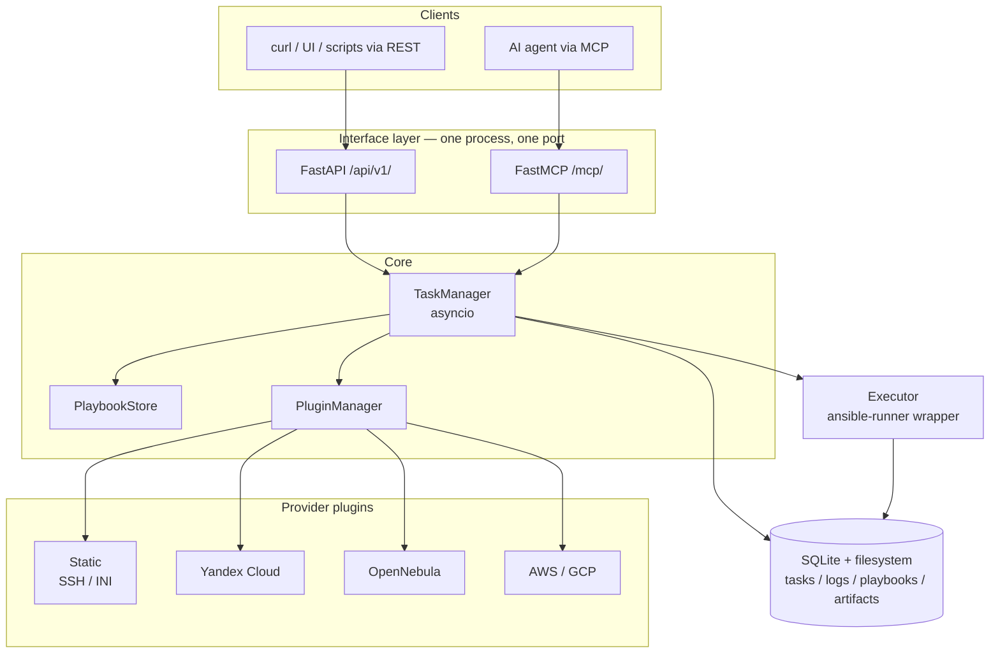

# Concept: what this project is for

> This document is the reasoning: the problem, who it is for, and the trade-offs
> accepted. What the code actually does now is in
> [Architecture](architecture.md).

## The problem

Running Ansible against a handful of hosts is easy. Running it *programmatically*, with
task history, logs and inventory management, is not — and the moment you want that, the
available options are heavy:

- **AWX / Ansible Automation Platform** need PostgreSQL, Redis, RabbitMQ, Receptor and
  (in practice) Kubernetes. Days to stand up, weeks to operate. Justified for a fleet of
  thousands of hosts, absurd for a lab with five.
- **Rolling your own** means re-implementing task lifecycle, log streaming, inventory
  generation and artifact storage every time — usually as a pile of bash around
  `ansible-playbook`.

A second problem appeared more recently: AI agents are now a realistic operator of
infrastructure, and they need a *machine-facing* interface. AWX has a REST API, but it
was designed for humans clicking through a UI — deep object graphs, dozens of calls to
launch one job. An agent needs a handful of well-named verbs.

## Who it is for

| Consumer | What they get |
|---|---|
| **DevOps / QA engineer with a small stand** (5–50 hosts) | Task history, logs and scheduling without operating a control plane |
| **Developer running an AI agent over their infrastructure** | An MCP endpoint the agent can drive directly — no glue code, no API wrapper |
| **CI / test environments** | A disposable controller that starts in one container and leaves no external dependencies behind |
| **Homelab / pet infrastructure** | AWX-shaped capability at a fraction of the operational cost |

The common denominator: someone who needs *an Ansible controller*, not *an automation
platform*.

## Role and place

This project sits between the agent (or script, or human) and `ansible-runner`:

```
decision making            →  agent / operator  (outside this project)
task execution + history   →  THIS PROJECT
playbook execution         →  ansible-runner → ansible-playbook
```

It is deliberately positioned as a **dumb executor**. It does not generate playbooks, it
does not decide what to run, it does not reason about your infrastructure. It receives a
task, executes it, records what happened, and reports back. Intelligence lives in the
agent that calls it — which is also why the LLM playbook generation from the original
prototype is being removed rather than extended: that responsibility belongs to the
caller.

## How it works



A typical run, driven by an agent:

1. `run_playbook(playbook="deploy.yml", provider="yc-prod", vars={...})`
2. The provider plugin generates an inventory (for a cloud provider, by querying its API).
3. The playbook and the inventory are **snapshotted** into the task record, so the run
   stays reproducible even if either changes later.
4. `ansible-runner` executes asynchronously; the call returns a task id immediately.
5. The agent polls `get_task_status` / `get_task_logs` and decides what to do next.

Provisioning works the same way: the agent calls `provision()`, gets an inventory back,
and feeds it into `run_playbook()`. The agent orchestrates; the controller executes each
step.

## Design principles

1. **Zero external dependencies** — SQLite instead of PostgreSQL, asyncio instead of
   Celery + Redis. One container, one volume, no broker.
2. **MCP first** — the REST API is secondary and exists for humans and scripts.
3. **Dumb executor** — no generation, no decisions, no opinions about your playbooks.
4. **Thin plugins** — a provider plugin produces an inventory and validates credentials;
   it does not implement Ansible modules.
5. **Single process** — one Python process serving both interfaces on one port.

## Advantages

- **One-line deployment**: `docker run -p 8080:8080 -v ./data:/data ansible-mcp`.
- **Agent-native**: MCP tools are the primary interface, not an afterthought bolted onto
  a human-facing API.
- **Reproducible runs**: playbook and inventory snapshots are stored per task.
- **Cloud-agnostic inventory**: the same playbook runs against static hosts, Yandex
  Cloud, OpenNebula or AWS depending on which provider is named.
- **No credentials at rest**: provider configuration references environment variable
  names; secrets never enter the database.
- **Extensible without forking**: external provider plugins register through
  `entry_points`.

## Trade-offs and limitations

These are consequences of the design, not bugs to be fixed later:

- **No multi-tenancy or RBAC.** A single API key gates the whole instance. If several
  teams need isolation, they run several instances — or they need AWX.
- **No horizontal scaling / HA.** SQLite and in-process asyncio mean one node. Fine for
  tens of hosts, wrong for thousands.
- **No web UI.** REST plus whatever the caller builds. A human-friendly surface is not
  on the roadmap.
- **Polling, not push.** Task status is pulled by the caller; there are no webhooks or
  event streams yet.
- **Secrets are the operator's problem.** Credentials come from environment variables;
  there is no Vault integration, no secret rotation, no per-task credential scoping.
- **Audit logging is minimal.** Task history exists, but "who did what, when, and under
  which identity" is not modelled — there are no users.
- **A dumb executor is only as good as its caller.** Nothing validates that the agent's
  chosen playbook is safe to run. The original prototype's safety validation is being
  dropped along with the generation feature; guardrails belong in the calling agent or
  in the playbooks themselves.

## Non-goals

- Replacing AWX / AAP for enterprise fleets.
- Generating playbooks with an LLM (removed — it is the caller's job).
- Building, storing or distributing execution-environment images. A run may be pointed
  at an existing container image, but the image catalogue, the registries and the build
  pipeline belong to the platforms above.
- Acting as a CMDB or source of truth for infrastructure.
- Providing a UI for humans to click through.

## Alternatives considered

| Option | Why it does not fit |
|---|---|
| AWX / AAP | Correct at scale; disproportionate operational cost for a small stand. No MCP interface for agents. |
| Semaphore UI | Lighter than AWX and has a UI, but is built around human workflows and still needs an external database. |
| `ansible-runner` called directly | No task history, no inventory management, no remote interface — every consumer re-implements the same scaffolding. |
| Agent shells out to `ansible-playbook` over SSH | Works until you need logs, concurrency, cancellation or reproducibility. |

## Open questions

- Scheduling: does a minimal controller need cron-like schedules, or is that the
  caller's responsibility too?
- Multi-node execution: is a single node enough forever, or is a worker protocol worth
  the complexity later?
- Event-driven triggers (webhooks / EDA-style rulebooks): valuable, or scope creep?
