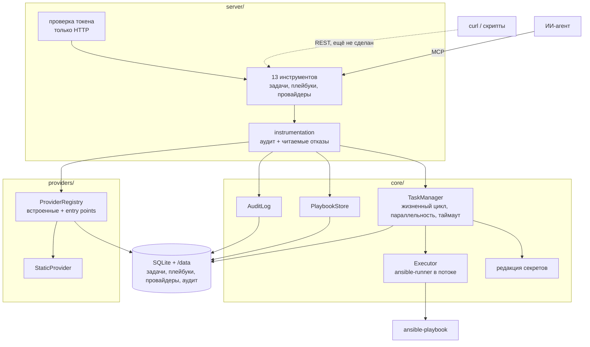
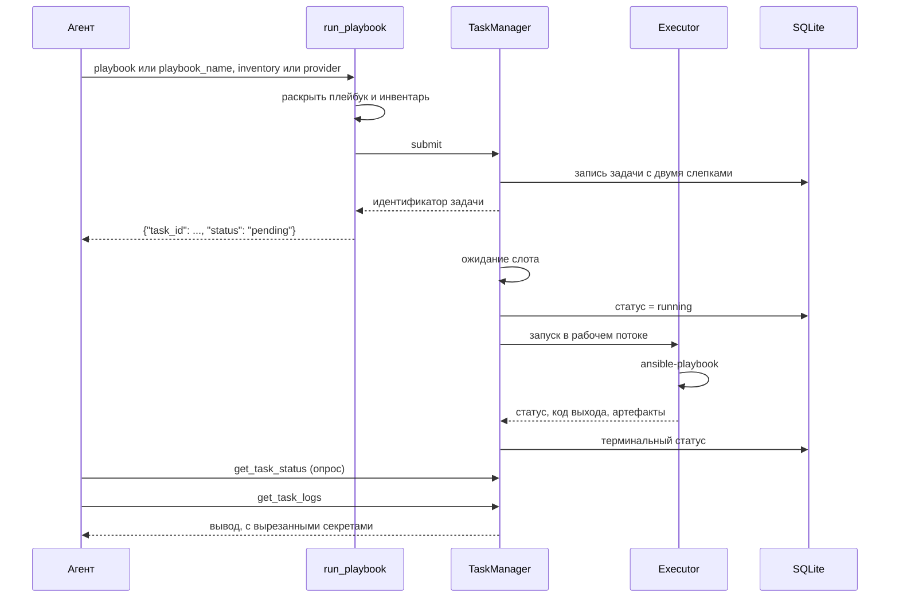

# Архитектура

Что код делает сейчас. Почему он так устроен — в [журнале решений](../adr/INDEX.md),
зачем он нужен — в [концепции](concept.md).

*English version: [docs/architecture.md](../architecture.md)*

## Общая схема



Три слоя и одно направление зависимостей: `server/` знает про `core/` и
`providers/`, они знают про `db/`, и никто не знает про `server/`.

## За что отвечает каждая часть

### `server/`

| Модуль | Ответственность |
|---|---|
| `app.py` | Собирает сервер, сервисы и lifespan; отказывается от небезопасной публикации |
| `tools/tasks.py` | `run_playbook`, `get_task_status`, `get_task_logs`, `cancel_task`, `list_tasks` |
| `tools/playbooks.py` | `save_playbook`, `list_playbooks`, `get_playbook`, `delete_playbook` |
| `tools/providers.py` | `add_provider`, `list_providers`, `get_inventory`, `delete_provider` |
| `instrumentation.py` | Одна обёртка на инструмент: пишет аудит, превращает сбой в одну фразу |
| `errors.py` | Как инструмент отказывает: `require`, `found`, `confirmed` |
| `coercion.py` | Принимает формы аргументов, которые агенты реально присылают |
| `http.py` | Проверка токена, `/healthz`, запуск uvicorn |

Инструмент — это функция с докстрингом, потому что докстринг и есть то, что
агент читает при выборе. Поэтому описания инструментов — часть контракта, а не
документация, и [eval-харнесс](../../evals/README.md) их измеряет.

### `core/`

`TaskManager` владеет прогоном от приёма до терминального статуса: сохраняет
задачу, ставит в очередь за семафором, применяет таймаут, которого нет у
`ansible-runner`, отменяет по запросу и при старте фейлит всё, что осталось
активным после падения процесса. Любой путь наружу пишет терминальный статус:
строка, застрявшая в `running`, — единственный отказ, от которого опрашивающий
агент не может оправиться.

`Executor` — единственное место, которое общается с `ansible-runner`. Библиотека
блокирующая, поэтому каждый прогон уходит в рабочий поток, а событийный цикл
остаётся свободным. Один каталог на прогон хранит использованные плейбук и
инвентарь и полученные артефакты.

`PlaybookStore` держит плейбуки по имени и отвергает текст, который плейбуком не
является. `redaction` убирает секреты из всего, что покидает процесс. `AuditLog`
пишет каждый вызов, его исход и задачу, которую он породил.

### `providers/`

Провайдер отвечает на один вопрос: какие хосты. `ProviderRegistry` держит
встроенные плагины и всё, что опубликовано через группу entry points
`ansible_mcp.providers`; сторонний плагин, который не импортируется,
логируется и пропускается. `Providers` хранит конфигурацию, сообщает, какие
провайдеры сейчас работоспособны, и раскрывает инвентарь по запросу.

## Как выглядит прогон



Слепки, снятые при приёме задачи, — причина того, что законченный прогон можно
разобрать после того, как плейбук или облачный инвентарь изменились (ADR-0005).

## Раскладка на диске

```
/data/
├── ansible_mcp.db          задачи, плейбуки, провайдеры, аудит
├── inventories/            единственное место, откуда провайдер читает файл
└── tasks/<id задачи>/
    ├── project/playbook.yml    что выполнялось
    ├── inventory/hosts         где выполнялось
    └── artifacts/<id задачи>/
        ├── stdout
        └── rc
```

`env/extravars`, куда `ansible-runner` пишет переменные прогона открытым
текстом, удаляется по завершении: значения уже в базе, и файлу нет причин
жить дольше прогона.

## Стек

Python 3.11, MCP SDK (`MCPServer`, ранее `FastMCP`), `ansible-runner` с
`ansible-core`, SQLAlchemy поверх SQLite в режиме WAL, `pydantic-settings`,
uvicorn и Starlette для HTTP-транспорта. Ни сервера БД, ни брокера, ни парка
воркеров (ADR-0003).

## Ограничения, которые стоит знать до чтения кода

- Один узел. SQLite и asyncio внутри процесса, параллельность ограничена
  семафором.
- Один токен на весь экземпляр, поэтому журнал аудита фиксирует, что было
  сделано, но не кем (ADR-0012).
- Переменные прогона лежат в базе открытым текстом, потому что без них прогон
  не воспроизвести. Файл базы — чувствительный артефакт.
- REST-поверхности пока нет, хотя ADR-0002 её обещает: MCP был первым, а REST
  ещё не написан.
