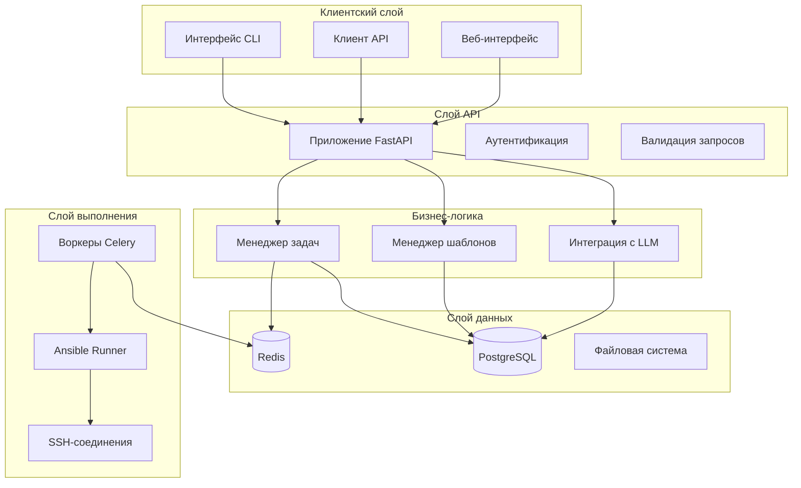
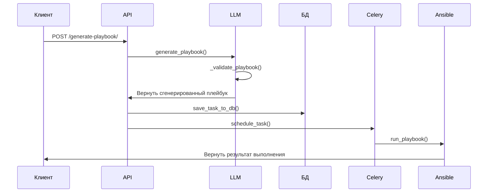
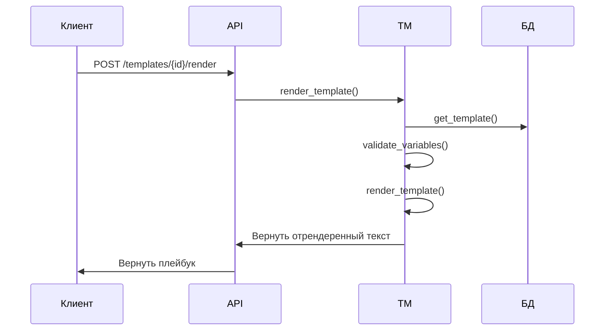

# Обзор архитектуры

*English version: [docs/architecture.md](../architecture.md)*

> **Внимание:** здесь описана архитектура текущего прототипа. Целевая архитектура
> (MCP, SQLite, asyncio, без Celery и LLM-генерации) описана в [Концепции](concept.md).

## Архитектура системы

Ansible-контроллер с LLM построен по современной микросервисной архитектуре с чётким
разделением ответственности и модульной структурой.

## Ключевые компоненты

### 1. Слой API (`src/crud/api.py`)

**Назначение**: предоставляет REST API для всех операций системы.

**Основные возможности**:
- REST API на FastAPI
- Автоматическая документация OpenAPI
- Валидация запросов и ответов через Pydantic
- Внедрение зависимостей для сессий базы данных
- Обработка ошибок и логирование

**Основные эндпоинты**:
- `POST /generate-playbook/` — генерация плейбука через LLM
- `POST /add-task/` — планирование обычной задачи
- `GET /templates/` — управление шаблонами
- `GET /health` — проверка состояния системы

### 2. Интеграция с LLM (`src/llm/`)

**Назначение**: генерация плейбуков через ИИ и управление шаблонами.

#### PlaybookGenerator (`src/llm/playbook_generator.py`)

**Основные функции**:
- `generate_playbook()` — главная функция генерации
- `_generate_with_openai()` — интеграция с API OpenAI
- `_generate_with_anthropic()` — интеграция с API Anthropic
- `_validate_playbook()` — проверка безопасности и синтаксиса
- `_extract_yaml_from_response()` — извлечение YAML из ответа модели

**Механизмы безопасности**:
- Обнаружение опасных конструкций
- Настраиваемые уровни безопасности
- Валидация YAML
- Проверка прав

#### TemplateManager (`src/llm/template_manager.py`)

**Основные функции**:
- `initialize_default_templates()` — создание шаблонов по умолчанию
- `create_template()` — создание нового шаблона
- `render_template()` — рендеринг шаблона с переменными
- `validate_variables()` — проверка переменных по схеме

### 3. Модели данных (`src/models/models.py`)

**Назначение**: описывают схему базы данных и структуры данных.

**Основные модели**:
- `TaskModel` — хранение задач Ansible
- `PlaybookTemplate` — хранение шаблонов и управление ими

**Возможности**:
- Интеграция с ORM SQLAlchemy
- Поддержка JSON-полей для метаданных
- Мягкое удаление
- Отслеживание временных меток

### 4. Управление задачами (`src/db/celery_app.py`)

**Назначение**: асинхронное выполнение задач и планирование.

**Основные функции**:
- `schedule_task()` — запланировать выполнение плейбука
- `run_playbook()` — выполнить плейбук Ansible
- `save_task_to_db()` — сохранить данные задачи
- `restore_tasks_from_db()` — восстановить задачи при старте

**Возможности**:
- Интеграция с Celery для асинхронной обработки
- Ansible Runner для выполнения плейбуков
- Работа с временными файлами сгенерированных плейбуков
- Обработка ошибок и логирование

### 5. Конфигурация (`src/config.py`)

**Назначение**: централизованное управление конфигурацией.

**Возможности**:
- Поддержка переменных окружения
- Валидация конфигурации
- Абстракция над провайдерами LLM
- Настройка уровня безопасности

## Потоки данных

### 1. Генерация плейбука

### 2. Рендеринг шаблона

## Архитектура безопасности

### 1. Валидация входных данных
- Модели Pydantic для валидации запросов
- Проверка синтаксиса YAML
- Контроль типов переменных
- Проверка обязательных полей

### 2. Проверки безопасности
- Обнаружение опасных конструкций
- Контроль повышения привилегий
- Применение уровней безопасности
- Валидация переменных шаблона

### 3. Контроль доступа
- Проверка ключей API для провайдеров LLM
- Безопасность подключения к базе данных
- Управление SSH-ключами
- Защита переменных окружения

## Вопросы масштабируемости

### 1. Горизонтальное масштабирование
- Приложение API без состояния
- Очередь задач на Redis
- Пул соединений с базой данных
- Развёртывание в контейнерах

### 2. Оптимизация производительности
- Асинхронная обработка задач
- Кеширование шаблонов
- Индексы в базе данных
- Пул соединений

### 3. Мониторинг и наблюдаемость
- Эндпоинты проверки состояния
- Структурированное логирование
- Отслеживание ошибок
- Метрики производительности

## Технологический стек

### Бэкенд
- **Python 3.9+** — основной язык
- **FastAPI** — веб-фреймворк
- **SQLAlchemy** — ORM
- **Celery** — очередь задач
- **Redis** — брокер сообщений
- **PostgreSQL** — основная база данных

### ИИ
- **OpenAI GPT-4** — основной провайдер LLM
- **Anthropic Claude** — альтернативный провайдер LLM
- **Jinja2** — движок шаблонов

### Инфраструктура
- **Docker** — контейнеризация
- **Docker Compose** — оркестрация нескольких контейнеров
- **Ansible Runner** — выполнение плейбуков
- **SSH** — удалённое выполнение

### Разработка
- **Pytest** — тесты
- **Black** — форматирование кода
- **Flake8** — линтер
- **Click** — фреймворк CLI

## Паттерны проектирования

### 1. Внедрение зависимостей
- Управление сессиями базы данных
- Внедрение конфигурации
- Абстракция сервисного слоя

### 2. Репозиторий
- Абстракция доступа к базе данных
- Управление шаблонами
- Персистентность задач

### 3. Фабрика
- Выбор провайдера LLM
- Рендеринг шаблонов
- Создание задач

### 4. Стратегия
- Реализация уровней безопасности
- Переключение провайдеров LLM
- Стратегии валидации

## Обработка ошибок

### 1. Ошибки API
- Коды состояния HTTP
- Структурированные ответы об ошибках
- Детали ошибок валидации
- Ограничение частоты запросов

### 2. Ошибки LLM
- Сбои подключения к API
- Превышение лимита токенов
- Некорректные ответы
- Ошибки конкретного провайдера

### 3. Ошибки выполнения
- Сбои выполнения Ansible
- Проблемы SSH-соединения
- Ошибки файловой системы
- Ошибки базы данных

## Планы развития

### 1. Дополнительные провайдеры LLM
- Поддержка локальных моделей
- Интеграция собственных моделей
- Переключение между провайдерами при сбое

### 2. Расширенные возможности
- Версионирование плейбуков
- Откат изменений
- Продвинутое планирование
- Поддержка нескольких окружений

### 3. Интеграции
- Встраивание в конвейеры CI/CD
- Интеграция с системами мониторинга
- Системы уведомлений
