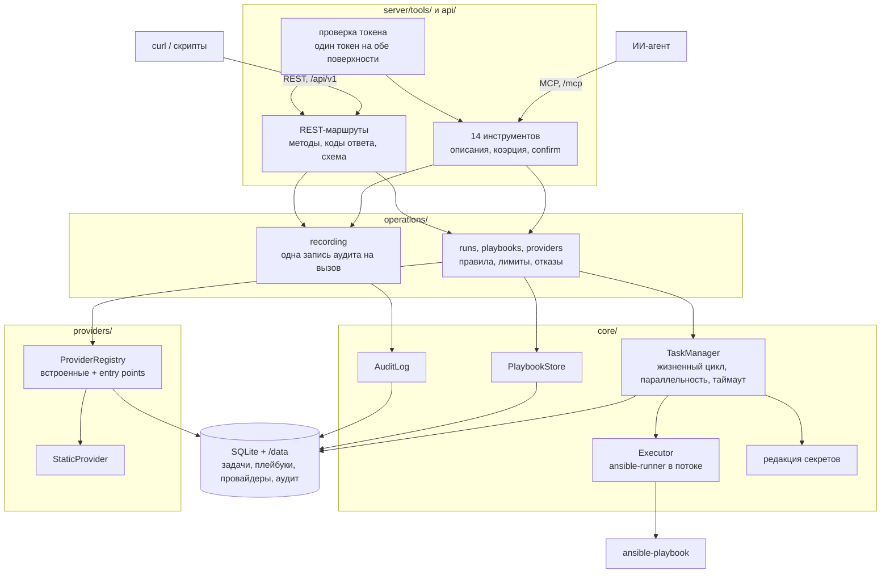
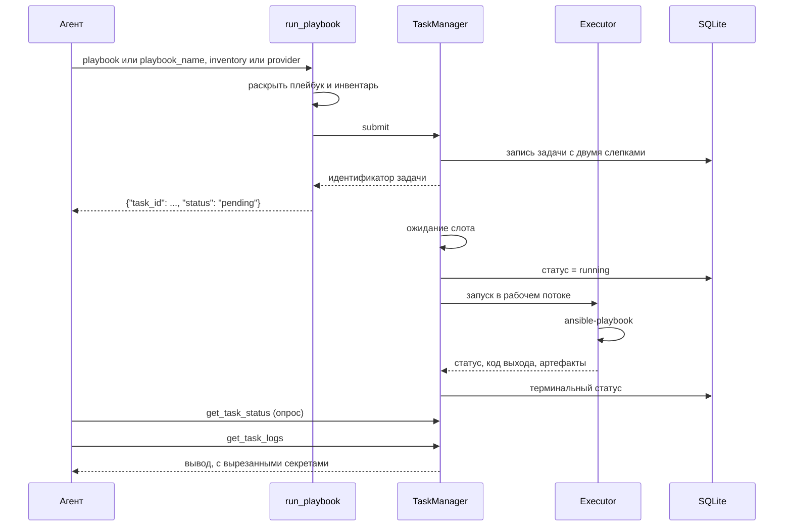

# Архитектура

Что код делает сейчас. Почему он так устроен — в [журнале решений](../adr/INDEX.md),
зачем он нужен — в [концепции](concept.md).

*English version: [docs/architecture.md](../architecture.md)*

## Общая схема



Четыре слоя и одно направление зависимостей. Обе поверхности знают про
`operations/`, `operations/` знает про `core/` и `providers/`, те — про `db/`, и
никто не знает про поверхность. Именно это позволяет одному и тому же отказу
дойти до агента фразой, а до скрипта — кодом 400, и при этом ни одна из
поверхностей не держит собственного правила (ADR-0015).

## За что отвечает каждая часть

### `server/`

| Модуль | Ответственность |
|---|---|
| `app.py` | Собирает сервер, сервисы и lifespan; отказывается от небезопасной публикации |
| `tools/tasks.py` | `run_playbook`, `get_task_status`, `get_task_logs`, `cancel_task`, `list_tasks` |
| `tools/playbooks.py` | `save_playbook`, `syntax_check_playbook`, `list_playbooks`, `get_playbook`, `delete_playbook` |
| `tools/providers.py` | `add_provider`, `list_providers`, `get_inventory`, `delete_provider` |
| `instrumentation.py` | Одна обёртка на инструмент: пишет аудит, превращает сбой в одну фразу |
| `http.py` | Проверка токена, `/healthz` и запуск uvicorn, отдающий обе поверхности |

Инструмент — это функция с докстрингом, потому что докстринг и есть то, что
агент читает при выборе. Поэтому описания инструментов — часть контракта, а не
документация, и [eval-харнесс](../../evals/README.md) их измеряет. Чего
инструмент НЕ держит — так это правила, которое он применяет: оно живёт слоем
ниже, где его читают и REST-маршруты.

### `api/`

| Модуль | Ответственность |
|---|---|
| `app.py` | Собирает REST-приложение и его схему на `/api/v1/openapi.json` |
| `routes/runs.py` | `POST /runs`, `GET /runs`, `GET /runs/{id}`, `GET /runs/{id}/logs`, `POST /runs/{id}/cancel` |
| `routes/playbooks.py` | `GET`/`PUT`/`DELETE /playbooks[/{name}]`, `POST /syntax-checks` |
| `routes/providers.py` | `GET`/`PUT`/`DELETE /providers[/{name}]`, `GET /providers/{name}/inventory` |
| `models.py` | Что может быть в теле запроса; неизвестные поля отвергаются |
| `errors.py` | Отказ в код ответа: 400 — запрос неверен, 404 — этого здесь нет, 500 — сломались мы |

Параметра `confirm` здесь нет: на этой поверхности намерение выражает метод
(ADR-0015). Ответы — это JSON самих операций, а не отфильтрованная модель
ответа, поэтому поле, добавленное ниже, не может молча исчезнуть по дороге.

### `operations/`

| Модуль | Ответственность |
|---|---|
| `runs.py` | Запустить прогон, прочитать его статус и логи, отменить, перечислить недавние |
| `playbooks.py` | Сохранить, перечислить, прочитать, проверить синтаксис и удалить плейбук |
| `providers.py` | Настроить провайдера, получить инвентарь, удалить настройку |
| `errors.py` | Как вызов отвергается: `require`, `found`, `confirmed` |
| `coercion.py` | Принимает формы аргументов, которые вызывающие реально присылают |
| `limits.py` | Чем ограничен один ответ, кто бы его ни запросил |
| `recording.py` | Одна запись аудита на вызов, под именем, общим для обеих поверхностей |

Здесь живут «ровно одно из playbook или playbook_name», «сломанный плейбук
отвергается до того, как появится задача» и «не больше 2000 строк лога за
вызов». Правило, которое держат дважды, со временем начинает различаться в
копиях, — поэтому его держат один раз.

### `core/`

`TaskManager` владеет прогоном от приёма до терминального статуса: сохраняет
задачу, ставит в очередь за семафором, применяет таймаут, которого нет у
`ansible-runner`, отменяет по запросу и при старте фейлит всё, что осталось
активным после падения процесса. Любой путь наружу пишет терминальный статус:
строка, застрявшая в `running`, — единственный отказ, от которого опрашивающий
агент не может оправиться.

`Executor` — единственное место, которое общается с `ansible-runner`. Библиотека
блокирующая, поэтому каждый прогон уходит в рабочий поток, а событийный цикл
остаётся свободным. Один каталог на прогон хранит использованные плейбук и
инвентарь и полученные артефакты.

`PlaybookStore` держит плейбуки по имени и отвергает текст, который плейбуком не
является. `redaction` убирает секреты из всего, что покидает процесс. `AuditLog`
пишет каждый вызов, его исход и задачу, которую он породил.

### `providers/`

Провайдер отвечает на один вопрос: какие хосты. `ProviderRegistry` держит
встроенные плагины и всё, что опубликовано через группу entry points
`ansible_mcp.providers`; сторонний плагин, который не импортируется,
логируется и пропускается. `Providers` хранит конфигурацию, сообщает, какие
провайдеры сейчас работоспособны, и раскрывает инвентарь по запросу.

## Как выглядит прогон



Слепки, снятые при приёме задачи, — причина того, что законченный прогон можно
разобрать после того, как плейбук или облачный инвентарь изменились (ADR-0005).

## Раскладка на диске

```
/data/
├── ansible_mcp.db          задачи, плейбуки, провайдеры, аудит
├── inventories/            единственное место, откуда провайдер читает файл
└── tasks/<id задачи>/
    ├── project/playbook.yml    что выполнялось
    ├── inventory/hosts         где выполнялось
    └── artifacts/<id задачи>/
        ├── stdout
        └── rc
```

`env/extravars`, куда `ansible-runner` пишет переменные прогона открытым
текстом, удаляется по завершении: значения уже в базе, и файлу нет причин
жить дольше прогона.

## Стек

Python 3.11, MCP SDK (`MCPServer`, ранее `FastMCP`), `ansible-runner` с
`ansible-core`, SQLAlchemy поверх SQLite в режиме WAL, `pydantic-settings`,
uvicorn и Starlette для HTTP-транспорта, FastAPI для REST-поверхности. Ни
сервера БД, ни брокера, ни парка воркеров (ADR-0003).

## Ограничения, которые стоит знать до чтения кода

- Один узел. SQLite и asyncio внутри процесса, параллельность ограничена
  семафором.
- Один токен на весь экземпляр, поэтому журнал аудита фиксирует, что было
  сделано, но не кем (ADR-0012).
- Переменные прогона лежат в базе открытым текстом, потому что без них прогон
  не воспроизвести. Файл базы — чувствительный артефакт.
- У одной и той же операции два имени: `run_playbook` и `POST /api/v1/runs`.
  Аудит пишет для обоих имя инструмента, поэтому REST-вызов виден под именем
  MCP, и ничто не говорит, через какую дверь он пришёл.
- Отдавать HTTP — значит поставить REST-приложение снаружи, и lifespan MCP
  запускает теперь оно. Тест внутри процесса этого не увидит: ASGI-транспорт
  вообще не шлёт lifespan, поэтому `tests/test_http_serving.py` поднимает
  настоящий сервер.
