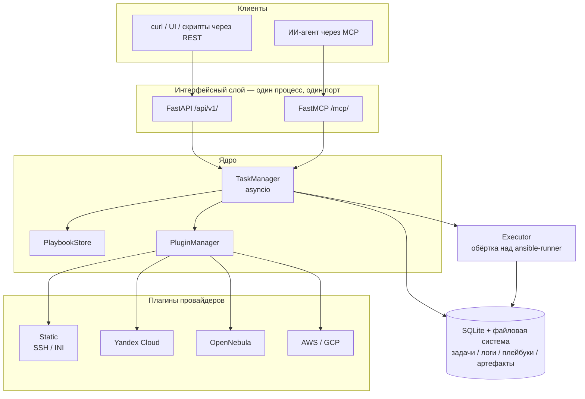

# Концепция: зачем нужен этот проект

> Статус: код в репозитории — всё ещё исходный прототип (генерация плейбуков через LLM,
> Celery, PostgreSQL, Redis). Этот документ описывает целевой продукт — минималистичный
> Ansible-контроллер с интерфейсом MCP — и рассуждения, которые к нему привели.
> Текущая реализация описана в [Обзоре архитектуры](architecture.md).
>
> English version: [docs/concept.md](../concept.md)

## Проблема

Запустить Ansible на десятке хостов просто. Запускать его *программно* — с историей задач,
логами и управлением инвентарём — уже нет. И как только это становится нужно, выбор
оказывается тяжёлым:

- **AWX / Ansible Automation Platform** требуют PostgreSQL, Redis, RabbitMQ, Receptor и
  (на практике) Kubernetes. Дни на развёртывание, недели на эксплуатацию. Оправдано для
  парка в тысячи хостов, абсурдно для лаборатории из пяти.
- **Написать своё** означает каждый раз заново реализовывать жизненный цикл задач,
  стриминг логов, генерацию инвентаря и хранение артефактов — обычно в виде кучи bash
  вокруг `ansible-playbook`.

Недавно добавилась вторая проблема: ИИ-агенты стали реальным оператором инфраструктуры,
и им нужен интерфейс, рассчитанный на машину. У AWX есть REST API, но он спроектирован
под человека, кликающего в интерфейсе: глубокие графы объектов, десяток вызовов ради
запуска одной задачи. Агенту нужна горстка понятно названных глаголов.

## Кому это нужно

| Потребитель | Что получает |
|---|---|
| **DevOps- или QA-инженер с небольшим стендом** (5–50 хостов) | История задач, логи и планирование запусков без эксплуатации отдельного control plane |
| **Разработчик, который водит ИИ-агента по своей инфраструктуре** | MCP-эндпоинт, которым агент управляет напрямую — без склеивающего кода и обёрток над API |
| **CI и тестовые окружения** | Одноразовый контроллер: поднимается одним контейнером и не оставляет внешних зависимостей |
| **Домашняя лаборатория, pet-инфраструктура** | Возможности уровня AWX за долю операционных затрат |

Общий знаменатель: человеку нужен *Ansible-контроллер*, а не *платформа автоматизации*.

## Роль и место

Проект стоит между агентом (или скриптом, или человеком) и `ansible-runner`:

```
принятие решений            →  агент / оператор  (вне этого проекта)
выполнение задач + история  →  ЭТОТ ПРОЕКТ
выполнение плейбука         →  ansible-runner → ansible-playbook
```

Позиция выбрана сознательно: это **тупой исполнитель**. Он не генерирует плейбуки, не
решает, что запускать, и не рассуждает о вашей инфраструктуре. Он получает задачу,
выполняет её, фиксирует, что произошло, и отдаёт результат. Интеллект живёт в агенте,
который его вызывает, — поэтому LLM-генерация плейбуков из исходного прототипа
удаляется, а не развивается: эта ответственность принадлежит вызывающей стороне.

## Как это работает



Типичный прогон глазами агента:

1. `run_playbook(playbook="deploy.yml", provider="yc-prod", vars={...})`
2. Плагин провайдера формирует инвентарь — для облака запросом к его API.
3. Плейбук и инвентарь **снимаются слепком** в запись задачи, поэтому прогон остаётся
   воспроизводимым, даже если то или другое потом изменится.
4. `ansible-runner` выполняет задачу асинхронно; вызов сразу возвращает идентификатор.
5. Агент опрашивает `get_task_status` / `get_task_logs` и решает, что делать дальше.

Провижининг устроен так же: агент вызывает `provision()`, получает обратно инвентарь и
передаёт его в `run_playbook()`. Агент оркестрирует, контроллер исполняет каждый шаг.

## Принципы дизайна

1. **Ноль внешних зависимостей** — SQLite вместо PostgreSQL, asyncio вместо Celery и
   Redis. Один контейнер, один том, никакого брокера.
2. **MCP в первую очередь** — REST API вторичен и существует для людей и скриптов.
3. **Тупой исполнитель** — никакой генерации, никаких решений, никаких мнений о ваших
   плейбуках.
4. **Тонкие плагины** — плагин провайдера отдаёт инвентарь и проверяет credentials; он
   не реализует Ansible-модули.
5. **Один процесс** — оба интерфейса обслуживает один Python-процесс на одном порту.

## Преимущества

- **Развёртывание одной строкой**: `docker run -p 8080:8080 -v ./data:/data ansible-mcp`.
- **Родной интерфейс для агентов**: MCP-инструменты — основной интерфейс, а не надстройка
  над API, спроектированным для человека.
- **Воспроизводимые прогоны**: слепки плейбука и инвентаря хранятся в каждой задаче.
- **Инвентарь независимо от облака**: один и тот же плейбук выполняется на статических
  хостах, в Yandex Cloud, OpenNebula или AWS — в зависимости от указанного провайдера.
- **Секреты не хранятся**: конфигурация провайдера ссылается на имена переменных
  окружения; сами секреты в базу не попадают.
- **Расширяется без форка**: внешние плагины провайдеров регистрируются через
  `entry_points`.

## Ограничения и компромиссы

Это следствия дизайна, а не недоработки, которые когда-нибудь починят:

- **Нет мультитенантности и RBAC.** Один API-ключ закрывает весь экземпляр. Если
  нескольким командам нужна изоляция — они поднимают несколько экземпляров или им нужен
  AWX.
- **Нет горизонтального масштабирования и HA.** SQLite и asyncio внутри процесса означают
  один узел. Нормально для десятков хостов, неверно для тысяч.
- **Нет веб-интерфейса.** REST и то, что вызывающая сторона построит сама. Удобная для
  человека поверхность в планы не входит.
- **Опрос, а не push.** Статус задачи забирает вызывающая сторона; вебхуков и потоков
  событий пока нет.
- **Секреты — забота оператора.** Credentials приходят из переменных окружения; нет
  интеграции с Vault, нет ротации, нет ограничения credentials на уровне задачи.
- **Аудит минимален.** История задач есть, но «кто, что, когда и под какой учётной
  записью» не моделируется — пользователей в системе нет.
- **Тупой исполнитель настолько хорош, насколько хорош вызывающий.** Ничто не проверяет,
  что выбранный агентом плейбук безопасно запускать. Проверки безопасности из исходного
  прототипа удаляются вместе с генерацией; ограничители должны жить в вызывающем агенте
  или в самих плейбуках.

## Чем проект сознательно не является

- Заменой AWX / AAP для корпоративных парков.
- Генератором плейбуков на LLM (удалено — это работа вызывающей стороны).
- Системой сборки, хранения и раздачи образов окружений выполнения. Прогон можно
  направить в уже существующий образ, но каталог образов, реестры и конвейер сборки —
  это уровень больших платформ.
- CMDB или источником истины об инфраструктуре.
- Интерфейсом, в котором человек кликает мышью.

## Рассмотренные альтернативы

| Вариант | Почему не подходит |
|---|---|
| AWX / AAP | Верное решение на масштабе; непропорциональные операционные затраты для небольшого стенда. Нет MCP-интерфейса для агентов. |
| Semaphore UI | Легче AWX и с интерфейсом, но построен вокруг человеческих сценариев и всё равно требует внешнюю БД. |
| Прямой вызов `ansible-runner` | Нет истории задач, управления инвентарём и удалённого интерфейса — каждый потребитель заново пишет одну и ту же обвязку. |
| Агент дёргает `ansible-playbook` по SSH | Работает ровно до момента, когда понадобятся логи, параллельность, отмена или воспроизводимость. |

## Открытые вопросы

- Планирование: нужны ли минимальному контроллеру cron-подобные расписания, или это тоже
  ответственность вызывающей стороны?
- Многоузловое выполнение: одного узла достаточно навсегда, или протокол воркеров позже
  оправдает усложнение?
- Событийные триггеры (вебхуки, правила в стиле EDA): ценность или расползание границ?
